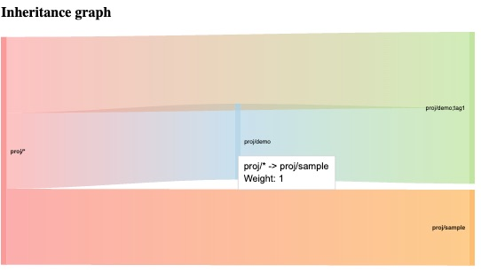
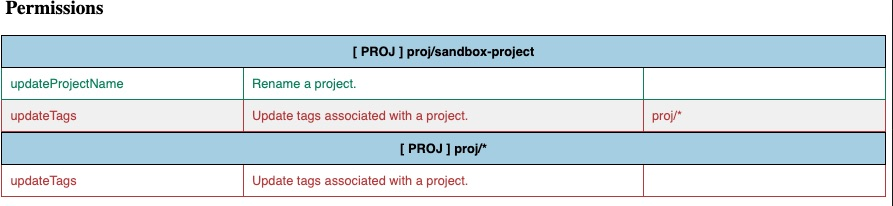

# Policy Checker

Polcy checker is a CLI for evaluating and detecting access permission overlap in LaunchDarkly policy (for custom roles).

For more details on how to create policies see doc [here](https://docs.launchdarkly.com/home/members/role-create).




## Features
- Evaluate resource permissions
- Display resources with overlapping permissions
see [CHANGELOG.md](changelog.md) for details.


# Getting Started

## Installation
1. Install NodeJS packages.
```
$> npm install
```


## Usage 
Run the policy checker using this sample command, this will generate the reports in `./output` directory.

``` 
node index.js <Policy JSON file>
```
To run using sample policy
```
npm run sample 
```

### Run tests   
```
npm test
```

To run with Mocha -watch option during development

```
npm run dev
```

```
  Test policy
    ✔ Must return the actions for proj/*
    ✔ Must return the actions for env/*
  

  Test utils
    ✔ Must return the resource name from resource string
    ✔ Must return resource actions for resource name

```

## Output 
The following reports are generated in the `./output` directory
* data.json  - your input policy file

* graph.json - list overlapping resources in your policy used in the graph in the report

* resourceActions.json - contains the resource and evaluated permissions that are listed in the HTML table.
* report.html - generated HTML report


## Built With
* [Sinon API Doc](https://sinonjs.org/releases/latest/)
* [Chai API Doc](https://www.chaijs.com/api/)
* [JSON2HTML](https://json2html.com/)
## Doc
### LaunchDarkly
[Role Policies](https://docs.launchdarkly.com/home/members/role-policies)
[Using Actions](https://docs.launchdarkly.com/home/members/role-actions)

## Sample files
### Sample Policy file (input file)
```
        [
            {
                "effect": "allow",
                "actions": [
                "createProject",
                "deleteProject"
                ],
                "resources": [
                "proj/sample",
                "proj/demo"
                ]
            },
            {
                "effect": "allow",
                "actions": [
                "updateProjectName"
                ],
                "resources": [
                "proj/demo;tag1"
                ]
            },
            {
                "effect": "deny",
                "actions": [
                "deleteProject"
                ],
                "resources": [
                "proj/*"
                ]
            },
            {
                "effect": "allow",
                "actions": [
                "updateTags"
                ],
                "resources": [
                "proj/*"
                ]
            }
        ]

```
### Sample graph.json (generated)
```
        {
        "proj/sample": [],
        "proj/demo": [
            "proj/demo;tag1"
        ],
        "proj/demo;tag1": [],
        "proj/*": [
            "proj/sample",
            "proj/demo",
            "proj/demo;tag1"
        ]
        }
```

### Sample resourceActions.json (generated)
```
    {
        "proj/sample": {
            "resourceString": "proj/sample",
            "type": "proj",
            "allow": [
                "createProject",
                "updateTags"
            ],
            "deny": [
                 "deleteProject"
            ]
        },
        "proj/demo": {
            "resourceString": "proj/demo",
            "type": "proj",
            "allow": [
                "createProject",
                "updateTags"
            ],
            "deny": [
                "deleteProject"
            ]
        },
        "proj/demo;tag1": {
            "resourceString": "proj/demo;tag1",
            "type": "proj",
            "allow": [
                "updateProjectName",
                "createProject",
                "updateTags"
            ],
            "deny": [
                "deleteProject"
            ]
        },
        "proj/*": {
            "resourceString": "proj/*",
            "type": "proj",
            "allow": [
                "updateTags"
            ],
            "deny": [
               "deleteProject"
            ]
        }
    }
```