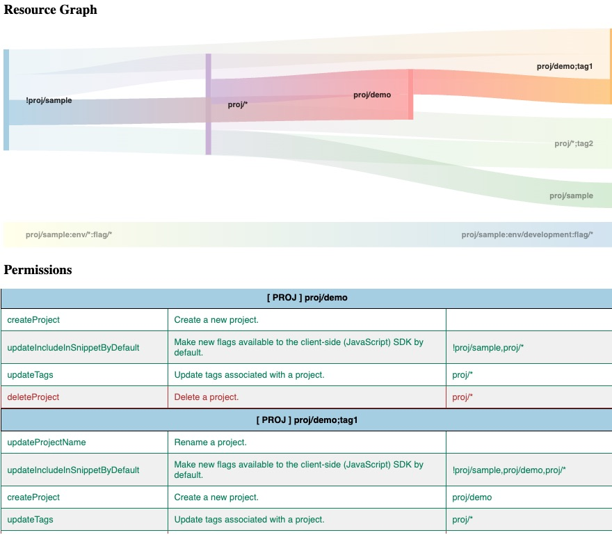

# Policy Checker

Policy checker is a CLI for evaluating permissions and detecting overlaps in your LaunchDarkly permission policy. 





## Features
- Evaluate resource permissions
- Display resources with overlapping permissions
- Valdiate Flag actions

see [CHANGELOG.md](CHANGELOG.md) for details.


# Getting Started
## Requirements
* Node.JS >= 16.14.0

## Built With
* [JSON2HTML](https://json2html.com/)
* [Google Chart](https://developers.google.com/chart)
* [Icon8](https://icons8.com)


## Installation
1. Install NodeJS packages.
```
$> npm install
```


# Usage 
Run the policy checker using this sample command, this will generate the reports in `./output` directory.
To run using sample policy
```
npm run sample 
```
To parse single or multiple policy JSON file
``` 
node index.js -f <Policy>
node index.js -f <Policy>  -f <Policy>
```
To parse multiple policy JSON files in a directory
```
node index.js -d <Policy directory>
```


> Note: Use the LaunchDarkly advanced editor to copy and save your policy, see doc [here](https://docs.launchdarkly.com/home/members/role-policies#writing-policies-in-the-advanced-editor)


### Run tests   
```
npm test
```

To run with Mocha -watch option during development

```
npm run dev
```

```
  Test policy
    ✔ Must return the actions for proj/*
    ✔ Must return the actions for env/*
  

  Test utils
    ✔ Must return the resource name from resource string
    ✔ Must return resource actions for resource name

```

## Output 
The following reports are generated in the `./output` directory
* data.json  - Your policy. Use the Advanced Editor in LaunchDarkly or API to copy your custom role policy

* graph.json - contains resources that have overlapping permissions, used in generating the chart.

* resourceActions.json - contains the resource permissions, used in generating the table.

* report.html -  HTML report


# Resources
### LaunchDarkly
* [Role Policies](https://docs.launchdarkly.com/home/members/role-policies)
* [Using Actions](https://docs.launchdarkly.com/home/members/role-actions)
