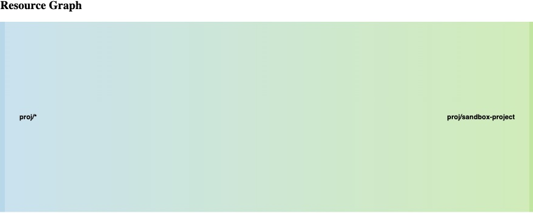

# Policy Checker

Policy checker is a CLI for evaluating permissions and detecting overlaps in your LaunchDarkly custom role policy. 


The report contains two sections
- Resource Graph. Displays the resources that have overlapping permissions.
- Permissions Table. Lists the defined and inherited permissions for each policy statement.

### Resource Graph
The resource graph shows overlapping statements in your policy. 

Using this sample Policy JSON:

*file: policy.json*
```json
[
  {
    "resources": [
      "proj/sandbox-project"
    ],
    "actions": [
      "updateProjectName",
      "updateTags"
    ],
    "effect": "allow"
  },
  {
    "resources": [
      "proj/*"
    ],
    "actions": [
      "updateTags"
    ],
    "effect": "deny"
  }
]
```
>  See  [Understanding  policies](https://docs.launchdarkly.com/home/members/role-policies#understanding-policies) for details on Policy attributes.

The above sample policy would produce a graph showing resources with overlapping permissions in a graph and a table of the defined and inherited permissions.
 

*file: report.html*




### Permissions Table
> Allowed actions are in GREEN and Denied actions are in RED

The permissions table shows actions listed in the **resourceActions.json**. 

*file: resourceActions.json*
```json
{
  "proj/sandbox-project": {
    "resourceString": "proj/sandbox-project",
    "type": "proj",
    "allow": [
      "updateProjectName"
    ],
    "deny": [
      "updateTags"
    ]
  },
  "proj/*": {
    "resourceString": "proj/*",
    "type": "proj",
    "allow": [],
    "deny": [
      "updateTags"
    ]
  }
}
```

## Features
- Evaluate resource permissions
- Display resources with overlapping permissions

see [CHANGELOG.md](CHANGELOG.md) for details.


# Getting Started
## Requirements
* Node.JS >= 16.14.0

## Built With
* [JSON2HTML](https://json2html.com/)
* [Google Chart](https://developers.google.com/chart)


## Installation
1. Install NodeJS packages.
```
$> npm install
```


# Usage 
Run the policy checker using this sample command, this will generate the reports in `./output` directory.
To run using sample policy
```
npm run sample 
```
``` 
node index.js <Policy file JSON>
```

> Note: Use the LaunchDarkly advanced editor to copy and save your policy, see doc [here](https://docs.launchdarkly.com/home/members/role-policies#writing-policies-in-the-advanced-editor)


### Run tests   
```
npm test
```

To run with Mocha -watch option during development

```
npm run dev
```

```
  Test policy
    ✔ Must return the actions for proj/*
    ✔ Must return the actions for env/*
  

  Test utils
    ✔ Must return the resource name from resource string
    ✔ Must return resource actions for resource name

```

## Output 
The following reports are generated in the `./output` directory
* data.json  - Your policy. Use the Advanced Editor in LaunchDarkly or API to copy your custom role policy

* graph.json - contains resources that have overlapping permissions, used in generating the chart.

* resourceActions.json - contains the resource permissions, used in generating the table.

* report.html -  HTML report


# Documentation

### LaunchDarkly
* [Role Policies](https://docs.launchdarkly.com/home/members/role-policies)

* [Using Actions](https://docs.launchdarkly.com/home/members/role-actions)
